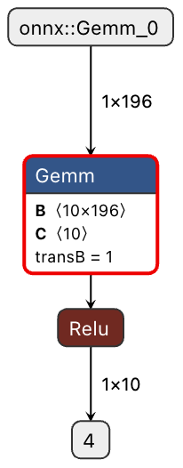
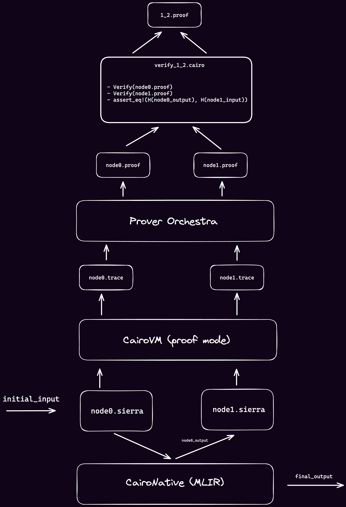

# Simple Cairo Network Example

This is a simple Machine Learning graph writing in Cairo for verifiable inference. 

## Prerequisites
Ensure you have the following installed:
- Rust
- [Scarb 2.6.4](https://docs.swmansion.com/scarb/download.html)

## ML model graph
Here is a visual representation of the ML model graph:


## Repo structure
The repository is organized as follows:
-  **ONNX Model File**: Located [here](model/simple_network.onnx).
-  **Cairo Programs**: Source code for the Cairo programs is in the [model/cairo_programs](model/cairo_programs) directory.
-  **Program Arguments**: Arguments for each Cairo program are found in [model/program_args](model/program_args).
-  **VM Results**: Generated trace and memory files are stored in [model/vm_results](model/vm_results)

## Generating Traces and Memory Files
To generate the traces and memory files, follow these steps:
1. **Compile Cairo Programs**
Navigate to each program directory and compile:
```shell
cd model/cairo_programs/node0
scarb build
```
```shell
cd model/cairo_programs/node1
scarb build
```
1. Run the Cairo VM in proof mode
From the root of the repository, execute:
```shell
cargo run
```
1. Get The Traces
The trace and memory files will be generated in the [vm_result](model/vm_results/) directory.

## Recursive Proving Plan (Entirely Offchain)

Each node of the network (Gemm and Relu operations) is handled by a separate Cairo program. The idea is to reduce the computational complexity of a Cairo program into small programs, and to prove all the nodes of the graph in parallel. Then use recursive prooving to merge the proofs and assert that the output of a node equals the input of the correlated node. 


Below is a diagram illustrating this concept:


